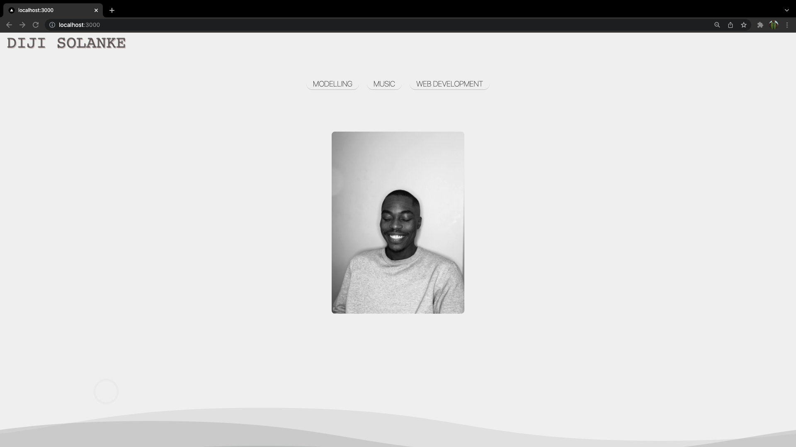
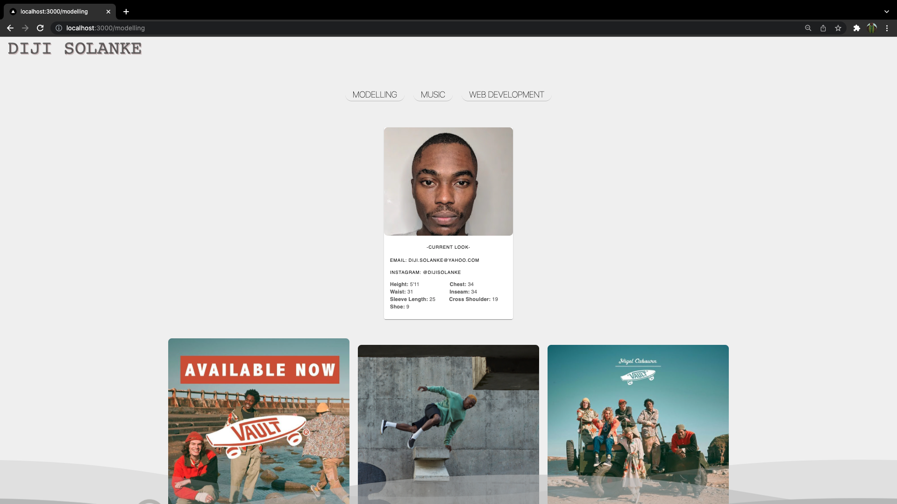
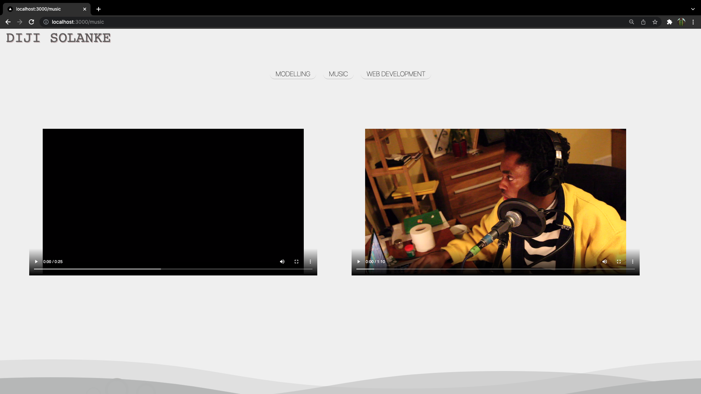
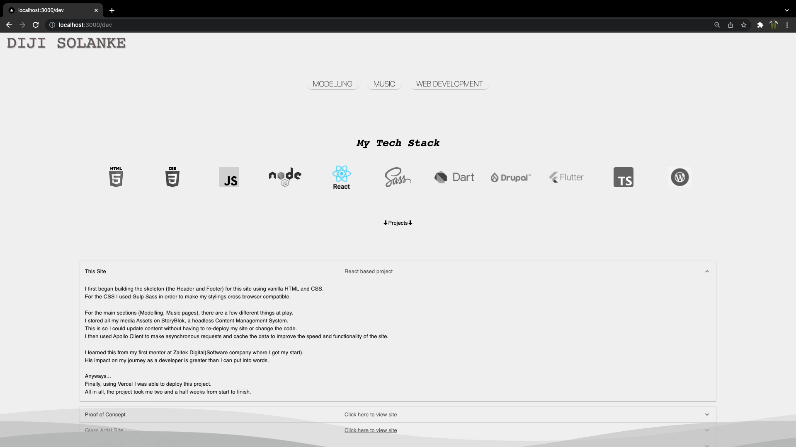

# MY FIRST WEBSITE
<h4>Link to Website:</h4>  http://sachadelabre.com

<h1>Synopsis</h1>

<h5>
This is my most recent Site. 
I built it using React and it took me two and a half weeks.
</h5>

<h1>
Softare stack:
</h1>

- HTML
- CSS
- REACT
- TYPESCRIPT
- SASS
- STORYBLOK(headless Content Management System)

<h1>More About</h1>

<h4>
This website is a personal Portfolio .
I made it in order to showcase my skill and track my development as a Dev.
</h4>

<h1>Experience gained</h1>

- In making this I gained a deeper understanding of React and its true power.

- I learned how to use styling libraries. The main one I used was Material UI

- I got to practice working with asynchronous get requests

- I got to practice using Javascript core features such as mapping and sorting

- I also got to learn how to deploy a project on Vercel

